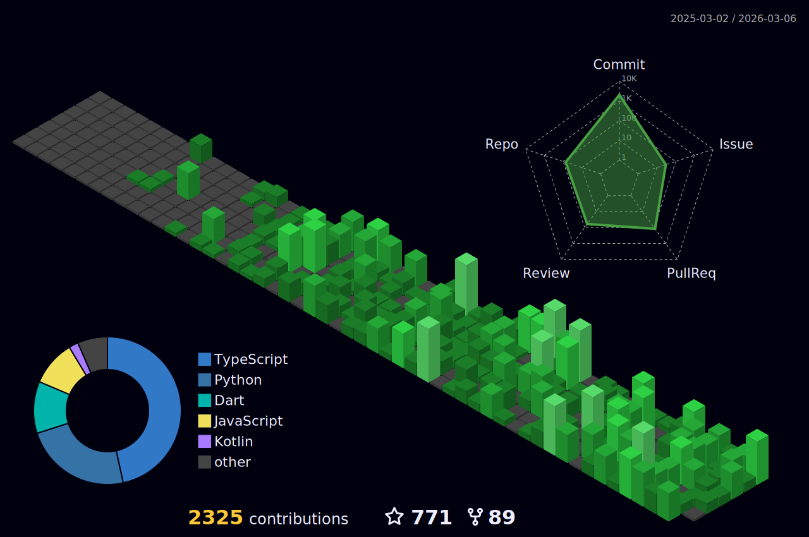

<div align="center">

# Hey there, I'm Mithun Gowda B 

[](https://mithungowda.in)

<a href="https://mithungowda.in" target="_blank">
  
</a>
<a href="mailto:mithungowda.b7411@gmail.com">
  
</a>
<a href="https://linkedin.com/in/mithungowdab" target="_blank">
  
</a>

<br/>


</div>

---

## About Me

```yaml
name: Mithun Gowda B
location: Karnataka, India
education: Engineering @ Don Bosco Institute of Technology (DBIT)
role: Co-Founder @ NextGenXplorrers

current_focus:
  - AI Frameworks & MCP Development
  - Open Source Contributions
  - Full-Stack Web & Mobile Apps

fun_fact: I code from Termux on Android
```


### Quick Facts

- Co-Founder of **[NextGenXplorrers](https://instagram.com/nexgenxplorerr)**
- Contributor to **SuperClaude**, **Devr.AI**, **SecOps Wrapper**
- Published on **[PyPI](https://pypi.org/user/mithungowda.b)** & **[npm](https://npmjs.com/~mithun50)**
- Currently exploring **AI/ML** and **System Design**

<br clear="right"/>

---

## Tech Stack

<div align="center">

### Languages


### Frameworks & Tools


</div>

---

## Notable Contributions


| Project | Description | Links |
|---------|-------------|-------|
| **SuperClaude** | Modular platform for advanced AI reasoning | [Repo](https://github.com/anthropics/claude-code) · [Web](https://superclaude.netlify.app) |
| **Google SecOps Wrapper** | Security automation SDK for Google Cloud | [Repo](https://github.com/google/secops-wrapper) |
| **AOSSIE - Devr.AI** | AI-powered Developer Relations assistant | [Repo](https://github.com/AOSSIE-Org/Devr.AI) |
| **Engineering Kannada** | Engineering concepts in regional language | [Repo](https://github.com/chandansgowda/engineering-in-kannada) · [Web](https://engineeringinkannada.in) |

---

## GitHub Analytics

<div align="center">


</div>

### Activity Graph
[](https://github.com/mithun50)

<div align="center">

[](https://github.com/mithun50)

</div>

<!-- 3D Contribution Graph - Auto Updated by GitHub Actions -->
<p align="center">
  
</p>

---

## Achievements

<div align="center">

[](https://github.com/mithun50)

</div>

---

## Connect with Me

<div align="center">

<a href="https://mithungowda.in" target="_blank"></a>&nbsp;&nbsp;
<a href="https://github.com/mithun50" target="_blank"></a>&nbsp;&nbsp;
<a href="https://linkedin.com/in/mithungowdab" target="_blank"></a>&nbsp;&nbsp;
<a href="https://x.com/mithungowdab" target="_blank"></a>&nbsp;&nbsp;
<a href="https://instagram.com/mithun.gowda.b" target="_blank"></a>&nbsp;&nbsp;
<a href="https://discord.gg/eamXcxtd" target="_blank"></a>&nbsp;&nbsp;
<a href="mailto:mithungowda.b7411@gmail.com"></a>

</div>

---

<div align="center">

**Thanks for visiting!** 


</div>
